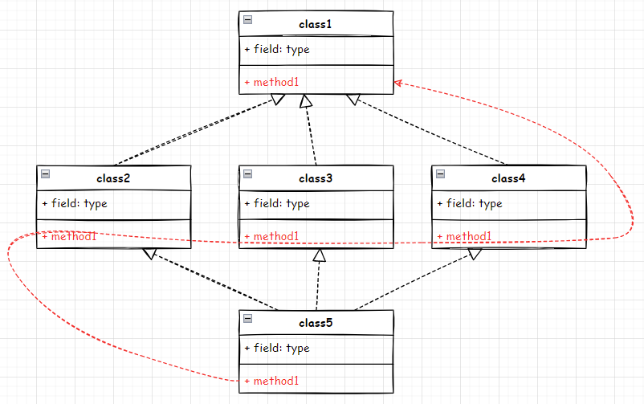
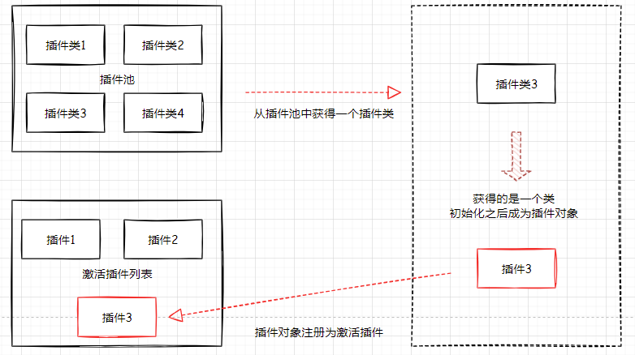

# angr内存模拟部分源码阅读

[toc]

本篇阅读了一下angr的源码，**侧重分析了一下程序状态state的插件部分，还有内存插件的实现，符号化内存地址寻址时的操作等。**

省流量直接看逻辑图：https://app.diagrams.net/#Hchenaotian%2Fangr-work%2Fmain%2Fangr.drawio

## angr简介

angr就是angr，这是它的logo:


### 代码结构

逻辑结构：


代码目录中一些比较关键的部分：
├── concretization_strategies：内存符号化策略
├── exploration_techniques：用于传给SimulationManager.use_technique，各种不同的探索方法
├── misc：一些初始类
├── procedures：函数摘要
├── simos：初始化类状态的，linux java啥的，state_entry就在这
├── state_plugins：状态的插件，内存、寄存器等的基础类
├── storage：**内存插件(memory_mixin)**、文件、网络类等

├── sim_state.py ：程序状态类，主要类，负责注册各种功能插件
├── factory.py：定义程序初始状态/入口的类
├── project.py：主要类，angr加载程序
└── sim_manager.py：模拟执行管理类，step、run等方法

## angr使用

不是本文的重点知识，但感觉还必须有这一节，可以参考：

## angr源码阅读

开始读源码，前面的部分快速看一眼干了啥就行，主要分析一下angr如何模拟内存的读写，还有遇到符号化内存地址寻址的时候的处理方法。详细的类之间的关系以及实现的功能请看[逻辑图](https://app.diagrams.net/#Hchenaotian%2Fangr-work%2Fmain%2Fangr.drawio)

### 入口部分&一些主要类

一般用angr初始化一个二进制程序分为一下几步骤：

```python
import angr
p = angr.Project("test.out")
state = p.factory.entry_state()
simgr = p.factory.simgr(state)#simgr是simulation_manager的别名
simgr.explore(find=xxxx)
```

前面的这些简单过一遍，不详细分析了，主要后面分析内存相关。

#### Project类

angr的入口，负责启动解析一个二进制文件，根据二进制文件的类型(如ELF、PE)去解析其中的一些信息，如程序段信息、程序入口点、程序导入导出函数表、程序架构、所属平台(Linux、Windows)信息等，其实就是将程序的基本信息获取一下，然后再初始化一些接下来会用到的其他类的对象，如factory等。

#### AngrObjectFactory类

AngrObjectFactory类就是上面代码中的p.factory，在Project类中被初始化，主要功能其实就是获取一个程序状态作为初始化状态，这里提供了不同的选择：

- entry_state：提供程序入口处的状态
- blank_state：空白状态，其状态由用户确认(执行地址、内存寄存器中的额值等)
- full_init_state：完整的初始化状态，从程序最开始处
- call_state：函数调用状态，类似blank_state，其他状态都要自己给定，但区别是可以设置参数快一些。

其实获取上面这些状态也不是factory 自己来实现的，他也是调用的SimOs类：

```python
class AngrObjectFactory:
	··· ···
    def entry_state(self, **kwargs) -> SimState:
        return self.project.simos.state_entry(**kwargs)
    ··· ···
```

#### SimOs类

SimOs是模拟操作系统的基本类，会根据操作系统的类型不同拍生成对应操作系统的类，比如SimLinux，上述的很多获得初始化状态的方法，都来自于SimOs中的state_blank方法：

```python
class SimOS:
    def state_blank(self, addr=None, initial_prefix=None, brk=None, stack_end=None, stack_size=1024*1024*8, stdin=None,
                    thread_idx=None, permissions_backer=None, **kwargs):
        #基本初始化状态函数
        # TODO: move ALL of this into the SimState constructor
        ··· ···

        if kwargs.get('permissions_map', None) is None: #初始化段权限
            ··· ···

        state = SimState(self.project, stack_end=stack_end, stack_size=stack_size, stack_perms=stack_perms, **kwargs)#在这里初始化SimState类

        if stdin is not None and not isinstance(stdin, SimFileBase):#stdin 指定了文件的话
            ··· ···

        last_addr = self.project.loader.main_object.max_addr
        actual_brk = (last_addr - last_addr % 0x1000 + 0x1000) if brk is None else brk
        state.register_plugin('posix', SimSystemPosix(stdin=stdin, brk=actual_brk)) 
        #posix 是 state中的插件，用于表示一些文件交互比如stdin等

        #后面初始化了寄存器、栈之类的一堆东西

```

总之就模拟操作系统执行程序之前，初始化了一堆东西。

#### SimulationManager类

该类主要可以通过一个输入程序状态来进行继续的单步执行(step)或run等操作，也是通过该类拉设置探索方式(ExplorationTechnique)。比较重要的类，但不在这里详细分析了。

### 插件系统

本篇重点分析的这一部分。

#### Mixin设计模式

首先了解一下angr里无处不在的Mixin设计模式：

Mixin是angr 的一个设计模式，从一个基类根据不同的小功能模块派生出一堆扩展类根据某个大功能需要的若干小功能，将这些小功能的扩展类一起用python 多继承的方法派生出一个最终的实现大功能的类。在调用该大功能中某个实现方法的时候，会依次使用super 调用下一个小功能中的该方法。就相当于多个小功能接力棒的形式依次完成自己的工作。**有些功能之间的关系是平行的(前后顺序无所谓)，有些功能之间的关系是依赖的(前后顺序不能颠倒)。**




如图所示，class2、class3、class4都是继承的class1，而class5 由class2、class3、class4共同多继承。而他们都实现了method1方法。并且在每个method1中都调用super().method1()，这样调用class5.method1()方法的时候就会按顺序调用52341的method1方法。根据这种思路，可以将一个复杂的逻辑拆成好几个小部分分别实现。在组合的时候也可以根据场景需要组合出适应不同场景功能的最终类。

#### 插件系统介绍

插件主要涉及三个类：

- PluginHub：插件管理器，管理一个插件池和一个激活插件列表
- PluginPreset：插件池类，存放可选激活的插件类(是类不是对象)

- SimStatePlugin：基本插件类，通过派生该类实现不同功能的插件

angr根据不同的大功能方向(如寄存器插件、内存插件)来划分插件，而不同种类的插件却拥有不止一种，如内存插件有默认的内存插件、快速内存插件、java的内存插件等等。而单个插件的实现使用了上面介绍的Mixin设计方法，将一个当个方向的大功能拆分成很多小功能，最后再多继承的方式组合成该大功能，这样几个相似功能的插件就可以实现部分小功能的复用。

##### PluginHub类

PluginHub类用作插件管理器，它通常会被派生成实际的插件管理器，比如程序状态类SimState就是派生自PluginHub，也就是说程序状态实际就是一个管理不同小状态插件的插件管理器。

```python
class PluginHub:
    def __init__(self):
        super(PluginHub, self).__init__()
        self._active_plugins = {} # type: Dict[str, SimStatePlugin]  正在使用的插件
        self._active_preset = None # type: Optional[PluginPreset]  正在使用的插件池
        self._provided_by_preset = [] # type: List[int] 
        
    _presets = None # 类属性，插件池，可以有多个插件池，主要使用默认插件池，里面都是PluginPreset类型对象
    @classmethod
    def register_default(cls, name, plugin_cls, preset='default'):
        #类方法，用来给默认插件池注册一个插件类。
        if cls._presets is None or preset not in cls._presets:
            l.error("Preset %s does not exist yet...", preset)
            return
        cls._presets[preset].add_default_plugin(name, plugin_cls)

    @classmethod 
    def register_preset(cls, name, preset):
        #类方法，给指定插件池注册一个插件类
        if cls._presets is None:
            cls._presets = {}
        cls._presets[name] = preset
        
    @property
    def plugin_preset(self):
        #可以直接获得插件池
        return self._active_preset
    
    ··· ···
    @property
    def has_plugin_preset(self) -> bool:#查看是否存在指定名称的插件池
        """
        Check whether or not there is a plugin preset in use on this hub right now
        """
        return self._active_preset is not None
    
    def use_plugin_preset(self, preset):
        #将一个插件池设置为启用状态
        if isinstance(preset, str):#如果通过字符串指定，查看是否有该名称的插件池，获取具体插件池对象
            try:
                preset = self._presets[preset]
            except (AttributeError, KeyError):
                raise AngrNoPluginError("There is no preset named %s" % preset)

        elif not isinstance(preset, PluginPreset):
            raise ValueError("Argument must be an instance of PluginPreset: %s" % preset)

        if self._active_preset:
            l.warning("Overriding active preset %s with %s", self._active_preset, preset)
            self.discard_plugin_preset()

        preset.activate(self) #调用插件池的激活函数
        self._active_preset = preset #表示启用该插件池
        
    def get_plugin(self, name: str) -> 'SimStatePlugin':
        #从当前激活的插件中获取指定名称的插件
        if name in self._active_plugins: #如果查询到直接返回
            return self._active_plugins[name]

        elif self.has_plugin_preset: #没找到的话要从插件池中寻找该插件类，并且初始化成一个对象再返回
            plugin_cls = self._active_preset.request_plugin(name) #获取插件类
            plugin = self._init_plugin(plugin_cls) #初始化该插件

            # Remember that this plugin was provided by preset.
            self._provided_by_preset.append(id(plugin))

            self.register_plugin(name, plugin)
            return plugin

        else:
            raise AngrNoPluginError("No such plugin: %s" % name)
        
    def register_plugin(self, name: str, plugin):
        #将一个初始化好的插件添加到激活列表，也就是注册一个插件
        if self.has_plugin(name): #如果已经存在该插件，先释放然后重新注册
            self.release_plugin(name)
        self._active_plugins[name] = plugin
        setattr(self, name, plugin)
        return plugin
```

- 类属性_presets 是一个PluginPreset 类的字典。用来表示可用的插件池，默认是有名为"default"的插件池
  - 在angr初始化的时候各个插件会将自己的插件类使用类方法register_default注册进default插件池
- 通过plugin_preset访问插件池
  1. 从插件池中根据名称获得插件类
  2. 获得了插件类需要将类初始化成对象
  3. 将初始化好的插件对象调用register_plugin注册成为激活插件，然后可以正常使用
- 插件池、插件、激活插件之间的关系：



##### PluginPreset类

插件池类，用于存取插件类：

```python
class PluginPreset:
    def __init__(self):
        self._default_plugins = {} # type: Dict[str, Type['SimStatePlugin']]存放插件类的字典
        
    def add_default_plugin(self, name, plugin_cls):
        #将一个指定插件类添加进字典
        self._default_plugins[name] = plugin_cls
        
    def request_plugin(self, name: str) -> Type['SimStatePlugin']:
        #搜索指定名称的插件类
        try:
            return self._default_plugins[name]
        except KeyError:
            raise AngrNoPluginError("There is no plugin named %s" % name)
```

##### SimStatePlugin类

最基本的插件类，也就是Mixin涉及模型中的calss1的地位，所有基本插件都由该类派生。

#### 模拟内存插件

`angr/storage/memory_mixins/__init__.py`

```python
class MemoryMixin(SimStatePlugin):
    def __init__(self, memory_id=None, endness='Iend_BE'):
        super().__init__()
        self.id = memory_id
        self.endness = endness #端序
    def load(self, addr, **kwargs): 
        #比较重要的方法，从内存地址中读数据，需要派生类实现
        pass

    def store(self, addr, data, **kwargs):
        #比较重要的方法，向内存地址中写数据，需要派生类实现
        pass
```

内存插件的基本类MemoryMixin 派生自SimStatePlugin，而比较主要的两个内存功能即读写了，具体内存的功能通过派生MemoryMixin  类来实现。最后内存类会根据不同的小功能组合成不同的内存类型如：

```python
class DefaultMemory(
    HexDumperMixin, #实现hexdump方法，输出内存内容
    SmartFindMixin, #主要实现查找方法
    UnwrapperMixin, 
    NameResolutionMixin, 
    DataNormalizationMixin, 
    SimplificationMixin, 
    InspectMixinHigh, 
    ActionsMixinHigh, 
    UnderconstrainedMixin,
    SizeConcretizationMixin, #如果size 参数是符号的，那么将其具体化
    SizeNormalizationMixin, #将size 从向量转换成整数(如果是)
    AddressConcretizationMixin, #如果地址是符号的，将其具体化
    #InspectMixinLow,
    ActionsMixinLow,
    ConditionalMixin,
    ConvenientMappingsMixin,
    DirtyAddrsMixin,
    # -----
    StackAllocationMixin,
    ConcreteBackerMixin,
    ClemoryBackerMixin,
    DictBackerMixin,
    PrivilegedPagingMixin,
    UltraPagesMixin,
    DefaultFillerMixin,
    SymbolicMergerMixin,
    PagedMemoryMixin, #最基本的内存实现，模拟内存页
):
    pass


class DefaultListPagesMemory(
    HexDumperMixin,
    SmartFindMixin,
    UnwrapperMixin,
    NameResolutionMixin,
    DataNormalizationMixin,
    SimplificationMixin,
    ActionsMixinHigh,
    UnderconstrainedMixin,
    SizeConcretizationMixin,
    SizeNormalizationMixin,
    InspectMixinHigh,
    AddressConcretizationMixin,
    #InspectMixinLow,
    ActionsMixinLow,
    ConditionalMixin,
    ConvenientMappingsMixin,
    DirtyAddrsMixin,
    # -----
    StackAllocationMixin,
    ClemoryBackerMixin,
    DictBackerMixin,
    PrivilegedPagingMixin,
    ListPagesMixin,
    DefaultFillerMixin,
    SymbolicMergerMixin,
    PagedMemoryMixin,
):
    pass
```

##### PagedMemoryMixin类

PagedMemoryMixin 是内存插件实现小功能中最基本的内存实现，用于模拟内存页：

`angr\storage\memory_mixins\paged_memory\paged_memory_mixin.py`

```python
class PagedMemoryMixin(MemoryMixin):
    PAGE_TYPE: Type[PageType] = None  # 类属性，用于指定具体实现内存页的类，派生类会指定该属性
    def __init__(self,  page_size=0x1000, default_permissions=3, permissions_map=None, page_kwargs=None, **kwargs):
        super().__init__(**kwargs)
        self.page_size = page_size #内存页大小
        self._extra_page_kwargs = page_kwargs if page_kwargs is not None else {}

        self._permissions_map = permissions_map if permissions_map is not None else {} #内存页权限
        self._default_permissions = default_permissions
        self._pages: Dict[int, Optional[PageType]] = {} #内存页具体实现，通过PAGE_TYPE指定的类来实现
        
    def _get_page(self, pageno: int, writing: bool, **kwargs) -> PageType:
        #通过页编号获得对应的页对象(PAGE_TYPE的对象)
        force_default = True
        try: #存在直接返回
            page = self._pages[pageno]
        except KeyError:
            page = None
            force_default = False

        if page is None: #不存在说明第一次使用这一页，初始化
            page = self._initialize_page(pageno, force_default=force_default, **kwargs)
            self._pages[pageno] = page

        if writing:
            page = page.acquire_unique()
            self._pages[pageno] = page
        return page
    
    def load(self, addr: int, size: int=None, endness=None, **kwargs): #走到这里size 和addr 必须都是整数
        if endness is None:#端序
            endness = self.endness

        if type(size) is not int: #走到这里了size 和addr 必须都是int了
            raise TypeError("Need size to be resolved to an int by this point")

        if type(addr) is not int:
            raise TypeError("Need addr to be resolved to an int by this point")

        pageno, pageoff = self._divide_addr(addr) #获得page编号和偏移
        vals = []

        # fasttrack basic case
        if pageoff + size <= self.page_size: #没跨页，直接读取，调用page对象的load方法读取
            page = self._get_page(pageno, False, **kwargs) #获得指定页对象
            vals.append(page.load(pageoff, size=size, endness=endness, page_addr=pageno*self.page_size, memory=self, cooperate=True, **kwargs))

        else:#跨页，按页读取
            max_pageno = (1 << self.state.arch.bits) // self.page_size
            bytes_done = 0
            while bytes_done < size:
                page = self._get_page(pageno, False, **kwargs)
                sub_size = min(self.page_size-pageoff, size-bytes_done)
                vals.append(page.load(pageoff, size=sub_size, endness=endness, page_addr=pageno*self.page_size, memory=self, cooperate=True, **kwargs))

                bytes_done += sub_size
                pageno = (pageno + 1) % max_pageno
                pageoff = 0

        out = self.PAGE_TYPE._compose_objects(vals, size, endness, memory=self, **kwargs)
        l.debug("%s.load(%#x, %d, %s) = %s", self.id, addr, size, endness, out)
        return out

    def store(self, addr: int, data, size: int=None, endness=None, **kwargs):
        #原理和上面load类似。
```

但PagedMemoryMixin 却不能单独使用，因为具体通过什么方式模拟内存页(也就是PAGE_TYPE)是没有指定的，一般使用其派生内存页类。

具体实现一个单个内存页对象的，也就是PAGE_TYPE类，是由PageBase类派生的若干对象，拥有不同功能：

`angr\storage\memory_mixins\paged_memory\pages\__init__.py`

```python
class PageBase(HistoryTrackingMixin, RefcountMixin, CooperationBase, ISPOMixin, PermissionsMixin, MemoryMixin):
    pass

PageType = typing.TypeVar('PageType', bound=PageBase)
```

##### ListPagesMixin类

通过一个列表按字节模拟内存页的实现，列表下标即内存页地址：

`angr\storage\memory_mixins\paged_memory\paged_memory_mixin.py`

```python
class ListPagesMixin(PagedMemoryMixin):
    PAGE_TYPE = ListPage
```

可见ListPagesMixin 制定了PAGE_TYPE 为ListPage，接下来查看ListPage：

`angr\storage\memory_mixins\paged_memory\pages\list_page.py`

```python
class ListPage(MemoryObjectMixin, PageBase):
    def __init__(self, memory=None, content=None, sinkhole=None, mo_cmp=None, **kwargs):
        super().__init__(**kwargs)

        self.content: List[Optional[SimMemoryObject]] = content #模拟页的list
        self.stored_offset = set()
        if content is None:
            if memory is not None:
                self.content: List[Optional[SimMemoryObject]] = [None] * memory.page_size  # TODO: this isn't the best
        self._mo_cmp = mo_cmp

        self.sinkhole: Optional[SimMemoryObject] = sinkhole
        
    def load(self, addr, size=None, endness=None, page_addr=None, memory=None, cooperate=False, **kwargs):
        result = []
        last_seen = ...  # ;)

        for subaddr in range(addr, addr+size): #按字节读取内容
            item = self.content[subaddr]
            if item is None:
                item = self.sinkhole
            if item is not last_seen:
                if last_seen is None:
                    self._fill(result, subaddr, page_addr, endness, memory, **kwargs)
                result.append((subaddr + page_addr, item))
                last_seen = item

        if last_seen is None:
            self._fill(result, addr + size, page_addr, endness, memory, **kwargs)

        if not cooperate:
            result = self._force_load_cooperation(result, size, endness, memory=memory, **kwargs)
        return result
```

##### AddressConcretizationMixin类

AddressConcretizationMixin 类也是内存插件基本类派生的一个类，主要用于处理需要访问的内存地址是符号数据的情况：

`angr\storage\memory_mixins\address_concretization_mixin.py`

```python
class AddressConcretizationMixin(MemoryMixin):
    def __init__(self, read_strategies=None, write_strategies=None, **kwargs):
        super().__init__(**kwargs)

        self.read_strategies = read_strategies #用于从符号地址的内存中读数据
        self.write_strategies = write_strategies #写
        
    def _load_one_addr(self, concrete_addr: int, trivial: bool, addr, condition, size, read_value=None, **kwargs):
        """
        concrete_addr: 确认的地址具体值，必须是int
        trivial：如果为true 就省事了，直接读就行，说明地址本来就是具体值或者地址符号值但有唯一解啥的
        addr：地址原本的值，可能是符号
        condition：
        size：读的大小
        read_value：已经读出来的，如果地址中时符号表达式，则在这个基础上叠加条件
        """
        if trivial: #传入condition 有时候是none，trivial = true就是简单情况，等价于直接地址读取
            sub_condition = condition
        else:
            sub_condition = addr == concrete_addr #地址是否是确定值或唯一解 的布尔逻辑表达式
            if condition is not None:
                sub_condition = condition & sub_condition

        sub_value = super().load(concrete_addr, size=size, condition=sub_condition, **kwargs) #读

        if read_value is None: #目前没有缓存结果直接返回当前结果
            return sub_value
        else: #如果有缓存结果，用IF逻辑表达式链接起来
            return self.state.solver.If(addr == concrete_addr, sub_value, read_value) #返回的是一个逻辑表达式 而不是一个具体数

    def load(self, addr, size=None, condition=None, **kwargs):
        if type(size) is not int: #size 必须是int
            raise TypeError("Size must have been specified as an int before reaching address concretization")

        # Fast path
        if type(addr) is int: #addr是确定的
            return self._load_one_addr(addr, True, addr, condition, size, read_value=None, **kwargs)
        elif not self.state.solver.symbolic(addr): #addr 不是符号，得到一个确定的值
            return self._load_one_addr(self.state.solver.eval(addr), True, addr, condition, size, read_value=None,
                                       **kwargs)

        if self.state.solver.symbolic(addr) and options.AVOID_MULTIVALUED_READS in self.state.options: 
            return self._default_value(None, size, name='symbolic_read_unconstrained', **kwargs)

        try:#addr是符号，需要求具体
            concrete_addrs = self._interleave_ints(sorted(self.concretize_read_addr(addr, condition=condition))) #concrete_addrs 是addr 的所有/一个可能值
        except SimMemoryError:
            if options.CONSERVATIVE_READ_STRATEGY in self.state.options:
                return self._default_value(None, size, name='symbolic_read_unconstrained', **kwargs)
            else:
                raise

        # quick optimization so as to not involve the solver if not necessary
        trivial = len(concrete_addrs) == 1 and (addr == concrete_addrs[0]).is_true() #说明符号解唯一
        if not trivial: #符号解不唯一
            # apply the concretization results to the state
            constraint_options = [addr == concrete_addr for concrete_addr in concrete_addrs] #布尔表达式列表
            conditional_constraint = self.state.solver.Or(*constraint_options)
            self._add_constraints(conditional_constraint, condition=condition, **kwargs)

        # quick optimization to not introduce the DUMMY value if there's only one loop
        if len(concrete_addrs) == 1: #只解了一个解
            read_value = None
        else: #满足条件的有很多
            read_value = DUMMY_SYMBOLIC_READ_VALUE  #这是一个不应该被访问的哨兵值 一般就是结果最后的else

        for concrete_addr in concrete_addrs:
            # perform each of the loads
            # the implementation of the "fallback" value ought to be implemented above this in the stack!!
            read_value = self._load_one_addr(concrete_addr, trivial, addr, condition, size, read_value=read_value,
                                             **kwargs) #每一个都尝试读取，readvalue是当前已经读取过的缓存结果

        return read_value

    def _store_one_addr(self, concrete_addr: int, data, trivial: bool, addr, condition, size, **kwargs):
        if trivial:#省事
            sub_condition = condition
        else:
            sub_condition = addr == concrete_addr
            if condition is not None:
                sub_condition = condition & sub_condition
        super().store(concrete_addr, data, size=size, condition=sub_condition, **kwargs) #向内存存放

    def store(self, addr, data, size=None, condition=None, **kwargs):

        # Fast path
        if type(addr) is int: #整数直接操作
            self._store_one_addr(addr, data, True, addr, condition, size, **kwargs)
            return
        elif not self.state.solver.symbolic(addr): #不是符号值，则获得一个可行的然后去存放
            self._store_one_addr(self.state.solver.eval(addr), data, True, addr, condition, size, **kwargs)
            return

        if self.state.solver.symbolic(addr) and options.AVOID_MULTIVALUED_WRITES in self.state.options:
            # not completed
            return

        try:
            concrete_addrs = self._interleave_ints(sorted(self.concretize_write_addr(addr)))
        except SimMemoryError:
            if options.CONSERVATIVE_WRITE_STRATEGY in self.state.options:
                return  # not completed
            else:
                raise

        # quick optimization so as to not involve the solver if not necessary
        trivial = len(concrete_addrs) == 1 and (addr == concrete_addrs[0]).is_true()
        if not trivial:
            # apply the concretization results to the state
            constraint_options = [addr == concrete_addr for concrete_addr in concrete_addrs]
            conditional_constraint = self.state.solver.Or(*constraint_options)
            self._add_constraints(conditional_constraint, condition=condition, **kwargs)

            if len(concrete_addrs) == 1:
                # simple case: avoid conditional write since the address has been concretized to one solution
                super().store(concrete_addrs[0], data, size=size, **kwargs)
                return

        for concrete_addr in concrete_addrs:#所有地址都要操作
            # perform each of the stores as conditional
            # the implementation of conditionality must be at the bottom of the stack
            self._store_one_addr(concrete_addr, data, trivial, addr, condition, size, **kwargs)
```

在处理对符号内存地址的读写的时候，会先检验传入的地址是否是不是符号(如整数或列表啥的)，要么就是地址是符号地址，但有唯一解，这些情况都可以直接读写操作。

否则地址石锤符号，那么就会调用对应的预先设置的读写符号地址的策略中的concretize 方法求出具体值，一般会求出一个满足条件的值或若干个，根据你配置的策略而定。对求出的可能具体值/若干可能具体值都会依次调用下面的读写方法(后续功能的)，读方法最后会将所有的结果用OR链接成一个if..elif..elif..else表达式。

读写策略可以指定多个，会按顺序来执行，直到成功找到满足条件的。

`angr\storage\memory_mixins\address_concretization_mixin.py`

```python
class AddressConcretizationMixin(MemoryMixin):    
    def _create_default_read_strategies(self): #创建默认读策略
        """
        This function is used to populate `self.read_strategies` if by set-state time none have been provided
        It uses state options to pick defaults.
        """
        self.read_strategies = [ ]
        if options.APPROXIMATE_MEMORY_INDICES in self.state.options:
            # first, we try to resolve the read address by approximation
            self.read_strategies.append(
                concretization_strategies.SimConcretizationStrategyRange(1024, exact=False),
            )

        # then, we try symbolic reads, with a maximum width of a kilobyte
        self.read_strategies.append(
            concretization_strategies.SimConcretizationStrategyRange(1024)
        )

        if options.CONSERVATIVE_READ_STRATEGY not in self.state.options:
            # finally, we concretize to any one solution
            self.read_strategies.append(
                concretization_strategies.SimConcretizationStrategyAny(),
            )

    def _create_default_write_strategies(self):
        """
        This function is used to populate `self.write_strategies` if by set-state time none have been provided.
        It uses state options to pick defaults.
        """
        self.write_strategies = [ ]
        if options.APPROXIMATE_MEMORY_INDICES in self.state.options:
            if options.SYMBOLIC_WRITE_ADDRESSES not in self.state.options:
                # we try to resolve a unique solution by approximation
                self.write_strategies.append(
                    concretization_strategies.SimConcretizationStrategySingle(exact=False),
                )
            else:
                # we try a solution range by approximation
                self.write_strategies.append(
                    concretization_strategies.SimConcretizationStrategyRange(128, exact=False)
                )

        if options.SYMBOLIC_WRITE_ADDRESSES in self.state.options:
            # we try to find a range of values
            self.write_strategies.append(
                concretization_strategies.SimConcretizationStrategyRange(128)
            )
        else:
            # we try to find a range of values, but only for ASTs annotated with the multiwrite annotation
            self.write_strategies.append(concretization_strategies.SimConcretizationStrategyRange(
                128,
                filter=_multiwrite_filter
            ))

        # finally, we just grab the maximum solution
        if options.CONSERVATIVE_WRITE_STRATEGY not in self.state.options:
            self.write_strategies.append(
                concretization_strategies.SimConcretizationStrategyMax()
            )
```

- 默认的读策略是读一个满足条件的地址范围的所有值(SimConcretizationStrategyRange)或随便找一个满足条件的地址(SimConcretizationStrategyAny)
- 默认的写策略是写一个满足条件的地址范围的所有地址(SimConcretizationStrategyRange)或写到最大满足条件的地址处(SimConcretizationStrategyMax)

#### 符号内存地址具现化策略

上文提到的读写策略是由SimConcretizationStrategy 类派生出的若干策略，用户也可以开发自己的策略：

`angr\concretization_strategies\__init__.py`

```python
class SimConcretizationStrategy:
    def _max(self, memory, addr, **kwargs):#满足条件的最大值
        """
        Gets the maximum solution of an address.
        """
        return memory.state.solver.max(addr, exact=kwargs.pop('exact', self._exact), **kwargs)

    def _any(self, memory, addr, **kwargs):#随便找一个满足条件的值
        """
        Gets any solution of an address.
        """
        return memory.state.solver.eval(addr, exact=kwargs.pop('exact', self._exact), **kwargs)
    def _range(self, memory, addr, **kwargs): #求一个符号值的范围(最小-最大)
        """
        Gets the (min, max) range of solutions for an address.
        """
        return (self._min(memory, addr, **kwargs), self._max(memory, addr, **kwargs))
    def concretize(self, memory, addr, **kwargs): 
        #主要方法，在上面AddressConcretizationMixin类中被使用
        """
        Concretizes the address into a list of values.
        If this strategy cannot handle this address, returns None.
        """
        if self._filter is None or self._filter(memory, addr):
            return self._concretize(memory, addr, **kwargs)
```

派生的相应类比如：

`angr\concretization_strategies\range.py`

```python
class SimConcretizationStrategyRange(SimConcretizationStrategy):
    """
    Concretization strategy that resolves addresses to a range.
    """

    def __init__(self, limit, **kwargs): #pylint:disable=redefined-builtin
        super(SimConcretizationStrategyRange, self).__init__(**kwargs)
        self._limit = limit

    def _concretize(self, memory, addr, **kwargs): 
        mn,mx = self._range(memory, addr, **kwargs)
        if mx - mn <= self._limit:
            return self._eval(memory, addr, self._limit, **kwargs)
        return None
```

### SimState程序状态类

SimState类表示程序某一刻的状态，包括寄存器、内存、执行的地址等，除此之外还有很多与它相关的功能，如求解器等。之前介绍了，这些功能和属性都是以插件的形势存在的，如内存插件、求解器插件、寄存器插件等。之所以这么设置是因为，根据不同的架构或场景，寄存器、内存等的模拟方式肯定是不同的，这样根据不同场景激活不同的适用场景的功能插件就很方便。

```python
class SimState(PluginHub):
    def __init__(
            self,
            project=None,
            arch=None,
            plugins=None,
            mode=None,
            options=None,
            add_options=None,
            remove_options=None,
            special_memory_filler=None,
            os_name=None,
            plugin_preset='default',
            cle_memory_backer=None,
            dict_memory_backer=None,
            permissions_map=None,
            default_permissions=3,
            stack_perms=None,
            stack_end=None,
            stack_size=None,
            regioned_memory_cls=None,
            **kwargs):
        ··· ···

        if plugins is not None:#如果提前准备好了插件则注册
            for n,p in plugins.items():
                self.register_plugin(n, p, inhibit_init=True)

        if not self.has_plugin('memory'): #刚注册的插件没有memory的时候，则使用默认的内存注册策略
            if self.plugin_preset is None: #默认使用default 插件池
                self.use_plugin_preset('default')

            # Determine memory backend
            if self._is_java_project and not self._is_java_jni_project: #java情况
                sim_memory_cls = self.plugin_preset.request_plugin('javavm_memory')
                sim_memory = sim_memory_cls(memory_id='mem')

            elif o.ABSTRACT_MEMORY in self.options:
                # We use SimAbstractMemory in static mode.
                # Convert memory_backer into 'global' region.
                if cle_memory_backer is not None:
                    cle_memory_backer = {'global': cle_memory_backer}
                if dict_memory_backer is not None:
                    dict_memory_backer = {'global': dict_memory_backer}

                # TODO: support permissions backer in SimAbstractMemory
                sim_memory_cls = self.plugin_preset.request_plugin('abs_memory')
                sim_memory = sim_memory_cls(cle_memory_backer=cle_memory_backer, dict_memory_backer=dict_memory_backer,
                                            memory_id='mem', regioned_memory_cls=regioned_memory_cls)

            elif o.FAST_MEMORY in self.options:
                sim_memory_cls = self.plugin_preset.request_plugin('fast_memory')
                sim_memory = sim_memory_cls(memory_id='mem')

            else:
                #默认插件类，sys_memory，获得该插件类
                sim_memory_cls = self.plugin_preset.request_plugin('sym_memory')
                #初始化为插件对象
                sim_memory = sim_memory_cls(cle_memory_backer=cle_memory_backer, dict_memory_backer=dict_memory_backer, memory_id='mem',
                                            permissions_map=permissions_map, default_permissions=default_permissions,
                                            stack_perms=stack_perms, stack_end=stack_end, stack_size=stack_size)

            # Add memory plugin
            if not self._is_java_jni_project:#将插件对象注册
                self.register_plugin('memory', sim_memory, inhibit_init=True)

            else:
                #java类型的处理
```

## 参考

[angr官方文档](https://docs.angr.io/)